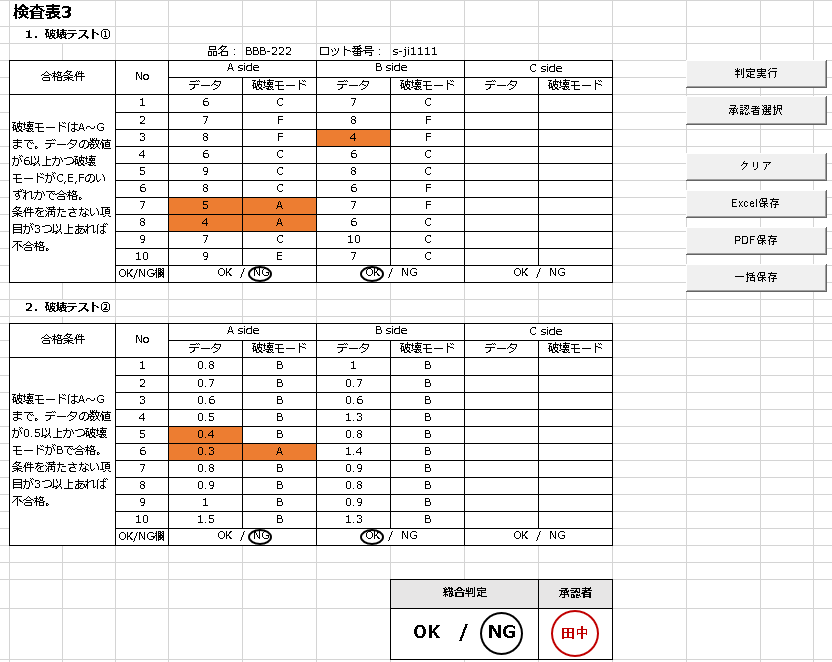

# 検査表3 — 検査表自動化ツール

Excel VBAで作成した検査表業務の自動化ツールです。品名ごとに検査項目が異なる仕様に対応しています。

## 機能

- **入力チェック**: 検査表の入力内容をチェック
- **品名別項目対応**: 品名によって検査項目が変わる仕様に対応
- **Bサイド・可変項目**: Bサイドと一番右の項目を入力するとメッセージが表示される。一番右の項目は名前を変更するとメッセージ内容にも反映される
- **基準判定**: 基準を満たしていない場合、該当セルの背景がオレンジ色になる
- **自動不合格判定**: オレンジ色(基準未達)が3つ以上付くと不合格と判定される
- **電子印鑑**: 電子印鑑の作成・押印
- **Excel保存**: 検査表をExcel形式で保存
- **PDF保存**: 検査表をPDF形式で保存(保存先フォルダを選択可能)
- **保存履歴**: 保存した検査表の履歴を管理

## シート構成

- `検査表`: 検査項目の入力・チェックを行うメインシート
- `電子印鑑`: 電子印鑑の作成・管理
- `保存履歴`: 保存履歴の記録

## 使用technology

- Excel VBA

## 使い方

1. `検査表3.xlsm` を開く(マクロを有効にする)
2. `検査表` シートで品名に応じた検査項目を入力
3. Bサイド・一番右の項目を入力するとメッセージを確認
4. 基準未達のセルはオレンジ色で表示され、3つ以上で不合格判定
5. 電子印鑑を押印
6. Excel/PDF形式で保存

## スクリーンショット

### 検査表画面

###
